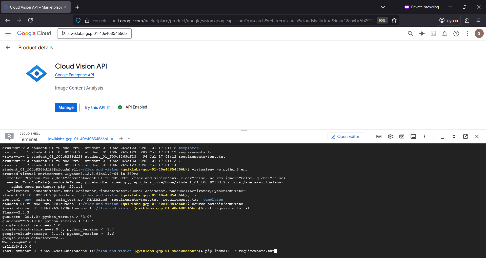
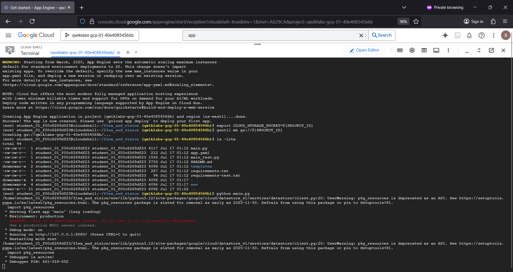
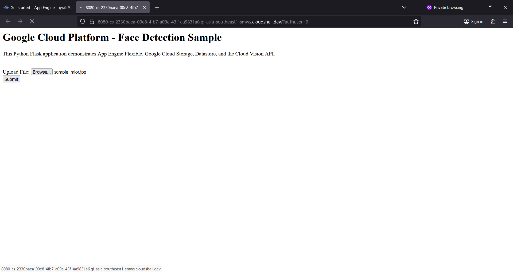
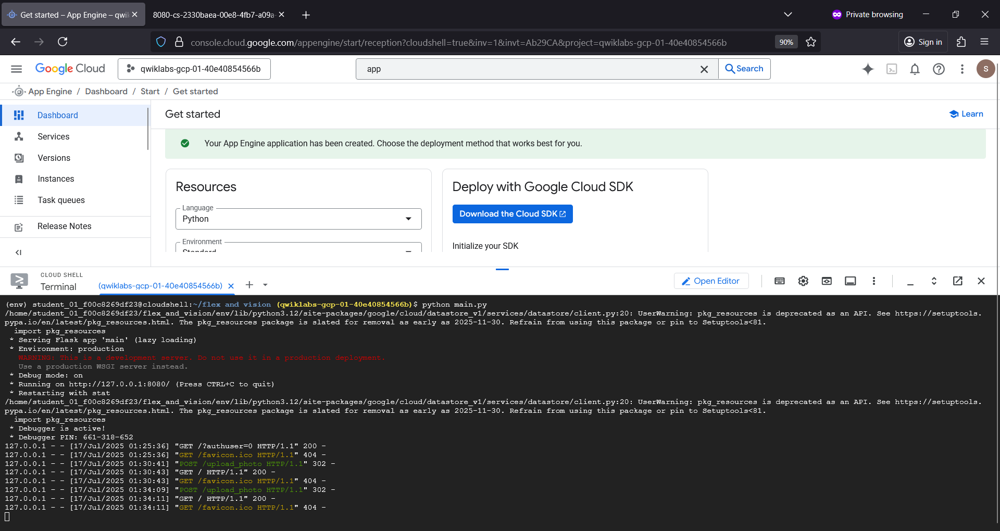
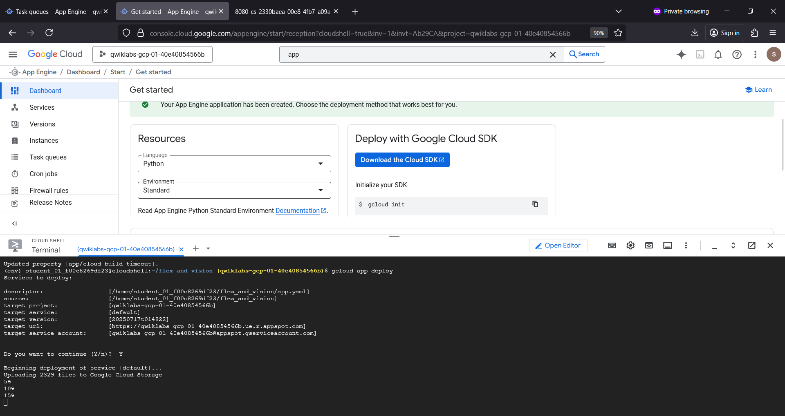
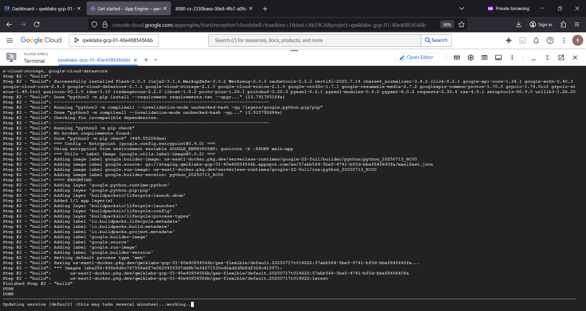
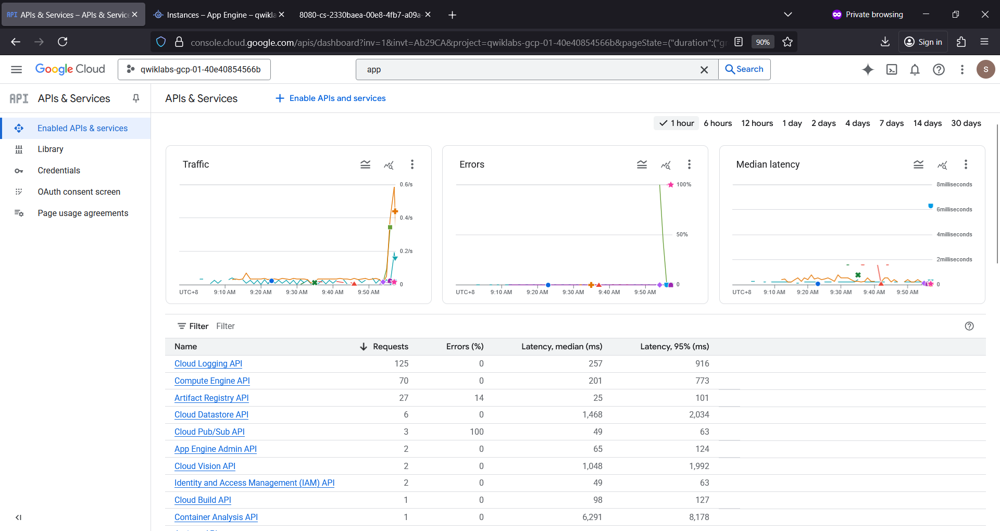
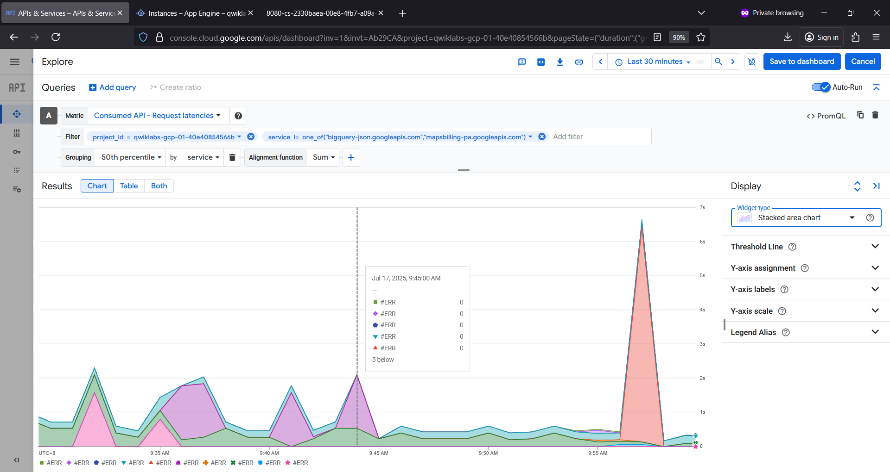
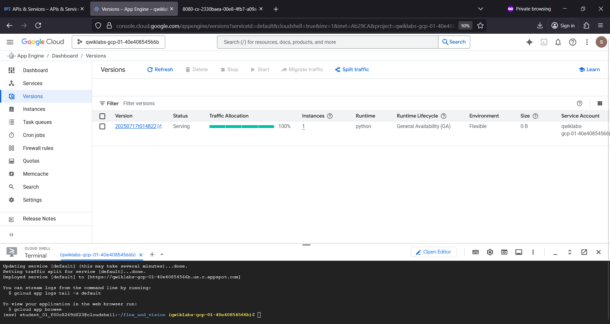
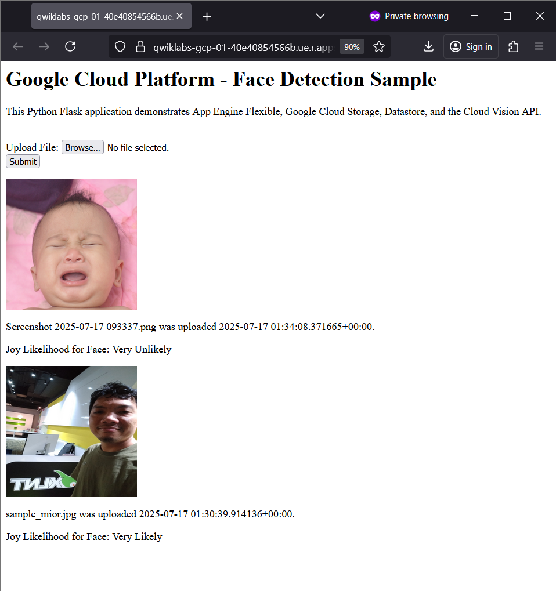

# flaskfaceapp 🫖😳
flaskfaceapp : Face Detection App # App Engine # Python # Flask # Jinja2 # Vision # GCP # Web

## Objective
- To deploy Python Flask Web Application to Google Cloud App Engine Flexible environment
- To leverage Cloud Vision API

## Python Flask Web Application to App Engine Flexible

